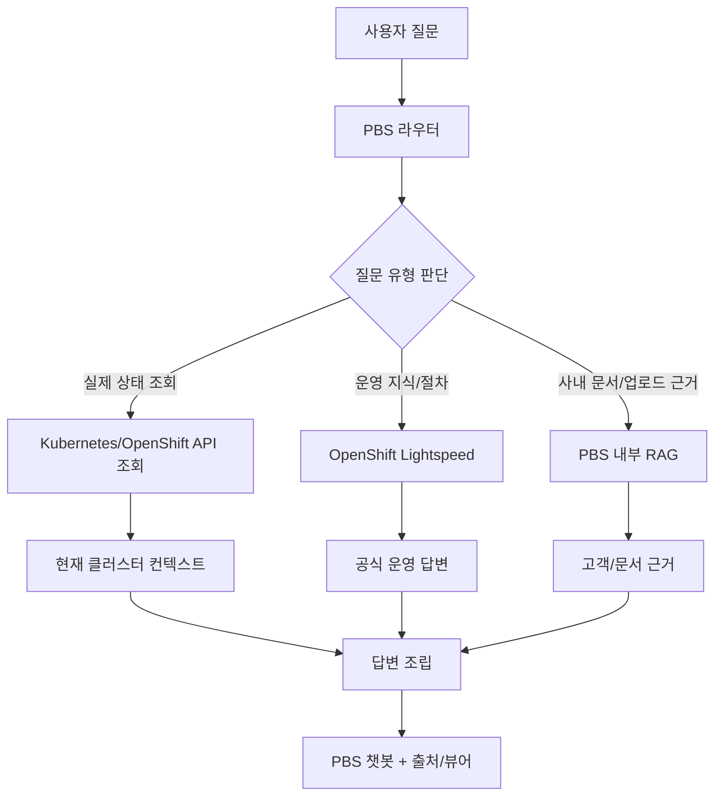

# PBS Live Cluster Context Expansion Plan

- Date: 2026-06-09
- Branch: `feat/kugnus-dev2.4`
- Head: `09ce6a4`
- Purpose: PBS가 OpenShift Lightspeed API 호출 품질 안정화를 넘어, 사용자 환경을 직접 이해하는 고객 맞춤 운영도구로 발전하기 위한 빠른 적용 계획을 정리한다.

## 현재 판단

PBS가 사용자 환경을 더 잘 알고 있으면 된다. 방향은 맞다. 장기적으로 PBS는 필요한 OpenShift/Kubernetes API를 직접 연결해야 하고, 그 결과를 Lightspeed 답변, PBS 내부 RAG, 고객 문서 근거와 함께 조립해야 한다.

다만 지금의 Lightspeed 품질 프로파일은 그 최종 구조를 대체하려는 기능이 아니다. OpenShift API 직접 연결이 완성되기 전까지 외부 Lightspeed 호출에서 간헐적으로 낮은 품질 답변이 들어오는 상황을 방어하는 중간 안전장치다.

## 왜 API 연결이 필요한가

웹콘솔의 OpenShift Lightspeed는 콘솔 내부에서 동작하기 때문에 다음 정보를 자연스럽게 알고 있을 가능성이 높다.

- 로그인 사용자
- 현재 클러스터
- 현재 namespace/project
- 사용자 권한
- OLSConfig와 introspection 상태
- 콘솔 화면 context
- 실제 pod, event, log, operator 상태

반면 PBS는 외부 클라이언트로 Lightspeed API를 호출한다. 같은 Lightspeed 서버를 호출하더라도 웹콘솔과 동일한 사용자/클러스터 context가 자동으로 붙는다고 볼 수 없다. 따라서 PBS가 고객 맞춤 운영도구가 되려면 직접 OpenShift API를 통해 현재 환경을 읽고, 그 결과를 답변 context로 사용해야 한다.

## 목표 구조

PBS는 질문 유형을 판단한 뒤 세 종류의 근거를 조합해야 한다.

1. 실제 상태 조회가 필요한 질문은 OpenShift/Kubernetes API를 호출한다.
2. 공식 운영 지식, 절차, troubleshooting 질문은 OpenShift Lightspeed를 호출한다.
3. 고객 문서, 업로드 문서, Gold Playbook 근거가 필요한 경우 PBS 내부 RAG를 사용한다.

## 빠른 적용 개발 단계

### 1단계: Lightspeed 외부 호출 품질 안정화

현재 진행 중인 단계다.

- Lightspeed 호출 성공 여부만 보지 않고 답변 품질을 검사한다.
- `events_list`, `pods_log` 같은 내부 tool/function 이름이 사용자 답변에 노출되면 품질 실패로 판정한다.
- 실패 시 PBS가 답변을 임의로 재작성하지 않고, OpenShift Lightspeed에 운영자용 CLI 답변 프로파일로 한 번 더 요청한다.
- 기대 답변은 `oc describe pod`, `oc get events`, `oc logs`, `--previous`, `-f`, `-n <namespace>`처럼 사용자가 실행 가능한 명령어 중심이다.

완료 기준:

- `이벤트와 로그는 어떤 명령으로 먼저 확인해?` 질문에서 내부 tool-name이 노출되지 않는다.
- 답변에 실행 가능한 OpenShift CLI 명령어가 포함된다.
- artifact와 call audit에 request profile, payload keys, quality 결과가 남는다.

### 2단계: OpenShift API read-only 연결

PBS가 실제 고객 환경을 읽기 시작하는 단계다.

우선 연결 대상:

- namespace/project 목록
- pod 목록과 status
- event 목록
- pod log 조회
- operator, Subscription, InstallPlan, CSV 상태
- route, service, ingress 상태
- storageclass, PVC, PV 상태

설계 원칙:

- 처음에는 read-only만 허용한다.
- 사용자 권한과 namespace 범위를 명확히 제한한다.
- 조회 결과는 답변에 바로 표시할 수 있는 구조화 데이터로 저장한다.
- 실패 시 `권한 부족`, `namespace 없음`, `API 연결 실패`, `timeout`처럼 실제 원인 단위로 드러낸다.

완료 기준:

- `openshift-lightspeed 네임스페이스의 pod 목록과 현재 status를 보여줘` 질문에 PBS가 실제 API 조회 결과를 표로 보여준다.
- 조회 결과가 Lightspeed 답변과 결합될 수 있다.
- 답변에는 실제 조회 시각, 대상 cluster/namespace, 조회 성공/실패 상태가 남는다.

### 3단계: Lightspeed + PBS live context 결합

PBS가 직접 조회한 현재 클러스터 상태를 Lightspeed 또는 내부 답변 조립 단계에 context로 넣는 단계다.

예상 흐름:

- 사용자가 운영 질문을 입력한다.
- PBS가 질문에서 namespace, resource type, 문제 유형을 추출한다.
- 필요한 경우 OpenShift API로 현재 상태를 조회한다.
- 조회 결과를 요약해 Lightspeed 질문 또는 후처리 context로 사용한다.
- 최종 답변은 공식 운영 절차와 현재 고객 환경 상태를 함께 설명한다.

예시:

- 질문: `openshift-lightspeed 네임스페이스 pod 상태를 보고 이상 여부를 알려줘`
- PBS 조회: pod 4개, 모두 Running, 일부 restart count 존재
- Lightspeed/PBS 답변: 현재 상태 요약, restart count 확인 지점, 다음 확인 명령, 관련 문서 링크 제공

완료 기준:

- 단순 문서 답변이 아니라 “현재 고객 클러스터 상태 기준”의 운영 답변이 나온다.
- 조회 데이터, Lightspeed 답변, PBS 문서 출처가 각각 다른 lane으로 추적된다.
- 어떤 근거가 실제 조회이고 어떤 근거가 문서인지 UI에서 구분된다.

### 4단계: 고객 문서와 live context 결합

고객 문서나 업로드 문서는 항상 억지로 붙이는 것이 아니라, 실제 질문과 의미 있는 관련이 있을 때만 보조 근거로 사용한다.

적합한 사용 예:

- 고객의 CI 절차 문서 + OpenShift Pipelines 공식 운영 답변
- 고객의 점검 체크리스트 + 현재 cluster 상태 조회
- 고객의 운영 완료보고서 + Compliance Operator 또는 event/log 진단 결과

부적합한 사용 예:

- OCR 품질이 낮고 본문 정보가 부족한 PPT를 억지로 RAG 근거로 붙이는 경우
- 고객 문서에 없는 성능 테스트 수치를 있는 것처럼 추론하는 경우
- 공식 운영 절차가 필요한 질문에 업로드 문서만으로 답변하는 경우

완료 기준:

- 고객 문서가 실제 검색 hit일 때만 근거로 표시된다.
- 고객 문서 품질이 낮으면 답변에 억지 반영하지 않는다.
- 고객 문서, Gold Playbook, Lightspeed, live API 조회 결과가 출처별로 구분된다.

### 5단계: 제어 기능

가장 마지막 단계다. 조회와 진단이 안정화된 뒤에만 진행한다.

후보 기능:

- rollout restart
- scale
- cordon/uncordon
- drain
- delete pod
- apply manifest

필수 안전장치:

- dry-run 우선
- 실행 전 사용자 confirmation
- RBAC 확인
- 명령 preview
- audit log
- rollback 또는 복구 절차 안내

완료 기준:

- PBS가 임의로 클러스터를 변경하지 않는다.
- 사용자가 실행 대상, 명령, 영향 범위를 확인한 뒤 승인해야 한다.
- 모든 실행 결과가 감사 로그로 남는다.

## 현재 품질 프로파일의 위치

현재 적용한 Lightspeed 품질 프로파일은 임시방편이 아니라 중간 안전장치다.

- 최종 목표: PBS가 OpenShift API를 직접 연결해 사용자 환경을 이해한다.
- 현재 필요: API 연결 전에도 Lightspeed 외부 호출 답변 품질을 방어한다.
- 하지 않는 것: PBS가 Lightspeed 답변을 임의로 창작하거나 재작성하지 않는다.
- 하는 것: Lightspeed 원문에 내부 tool-name이 노출될 때 Lightspeed에 더 명확한 사용자용 답변을 다시 요청한다.

## Acceptance Criteria

| 항목 | Pass 기준 | Evidence |
| --- | --- | --- |
| Lightspeed 품질 안정화 | 내부 tool-name 미노출, CLI 명령어 포함 | `/api/chat` response, artifact quality metadata |
| read-only API 연결 | namespace/pod/event/log 조회 가능 | API 응답, UI 표 렌더링 |
| live context 결합 | 실제 조회 결과 기준으로 운영 답변 생성 | 답변 내 조회 대상/시각/상태 포함 |
| 고객 문서 결합 | 의미 있는 hit일 때만 고객 문서 표시 | citation lane, source meta |
| 제어 기능 | 승인 기반 dry-run/audit 포함 | audit log, confirmation UI |

## 하지 않을 것

- OpenShift API 연결 전까지 PBS가 실제 클러스터 상태를 아는 것처럼 답변하지 않는다.
- 고객 문서 품질이 낮은데 억지로 근거로 붙이지 않는다.
- Lightspeed 답변을 PBS가 몰래 재작성하지 않는다.
- 조회 기능이 안정화되기 전에 제어 기능부터 붙이지 않는다.
- 권한과 감사 로그 없이 클러스터 변경 명령을 실행하지 않는다.

## 결론

PBS가 고객 맞춤 운영도구가 되려면 사용자 환경을 직접 알아야 한다. 따라서 필요한 OpenShift/Kubernetes API 연결은 빠른 시일 내에 추진해야 한다.

현재 Lightspeed 품질 프로파일은 그 최종 목표와 충돌하지 않는다. 오히려 OpenShift API 직접 연결이 완성되기 전까지 외부 Lightspeed 호출 품질을 방어하는 역할을 한다.

다음 개발 우선순위는 `read-only OpenShift API 연결 -> live context 답변 결합 -> 고객 문서 결합 정교화 -> 승인 기반 제어 기능` 순서가 적절하다.
